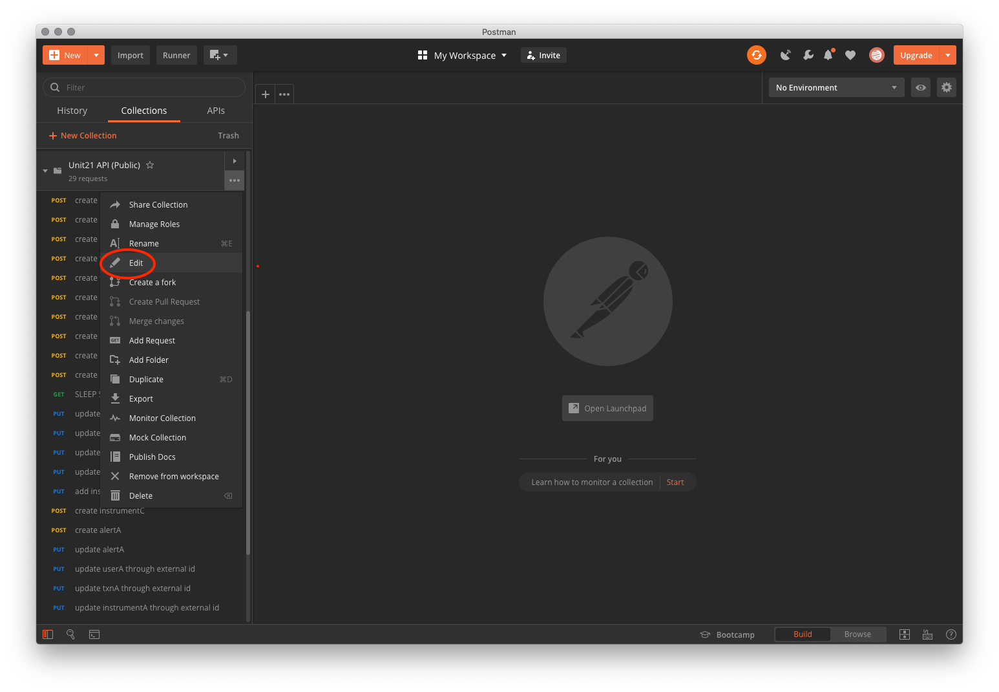

# Unit21's API description and Postman collection

A public mirror of U21's API documentation, with a Postman collection.

Unit21's API documentation uses the openAPI specification.
The API reference is hosted on [an interactive website](https://docs.unit21.ai/developers/reference),
where you can explore calls to different endpoints. 

As the OAS spec is very portable, Unit21 has made a copy of it available in this repo.
For most customers, the interactive site is the best way to explore the documentation.
However, some customers might find it useful to have a spec on hand, to do things like create a mock server, or simply explore the API using a different parser.

Additionally, there's also a Postman collection available, which includes a few calls that cannot be tested on the site (e.g. bulk event creation).

## Explore the API at openapi.yaml

Just download the file at [openapi.yaml](openapi.yaml).

## Instructions for the Postman collection

1. Download [the collection in this repo](Unit21_internal_API.postman_collection.json).

2. In Postman, select **Import** and import the collection JSON file (in v2.1 format).

3. Configure [collection variables](https://learning.postman.com/docs/postman/variables-and-environments/variables/#defining-variables-in-scripts). Click on options for the imported collection and select "Edit".

    

4. Populate the collection variables:
  * `host` with your sandbox environment, for example `sandbox2-api.unit21.com`.
  * `protocol` should be `https`.
  * `u21-key` with the [API key that you generated from the Unit21 dashboard](https://docs.unit21.ai/developers/reference/working-with-the-u21-api#authentication).
  * `orgName` with your organization name configured (passed to you by a Unit21 team member)

### Notes:

- To run a new test that avoids ID collisions, change the `randId` collection variable to a new value.
  For more convenience, you could create a collection-level script that automatically sets `randId` to be a random string upon running the first request in the collection e.g.

```jsx
if (pm.info.requestName == 'create userA') {
    var uuid = require('uuid')
    randId = uuid();
    pm.collectionVariables.set('randId', randId);
}
```

- If you encounter `423 LOCKED` responses from the API on **update** or **get** API requests,
  the requested object is still being processed. Retrying the request after a delay should result in a successful request.
    - The `(OPTIONAL) Sleep 5 S` requests are included in the collection
      to avoid `424 LOCKED` responses when running the collection requests in quick succession i.e. using Postman Collection Runner.
